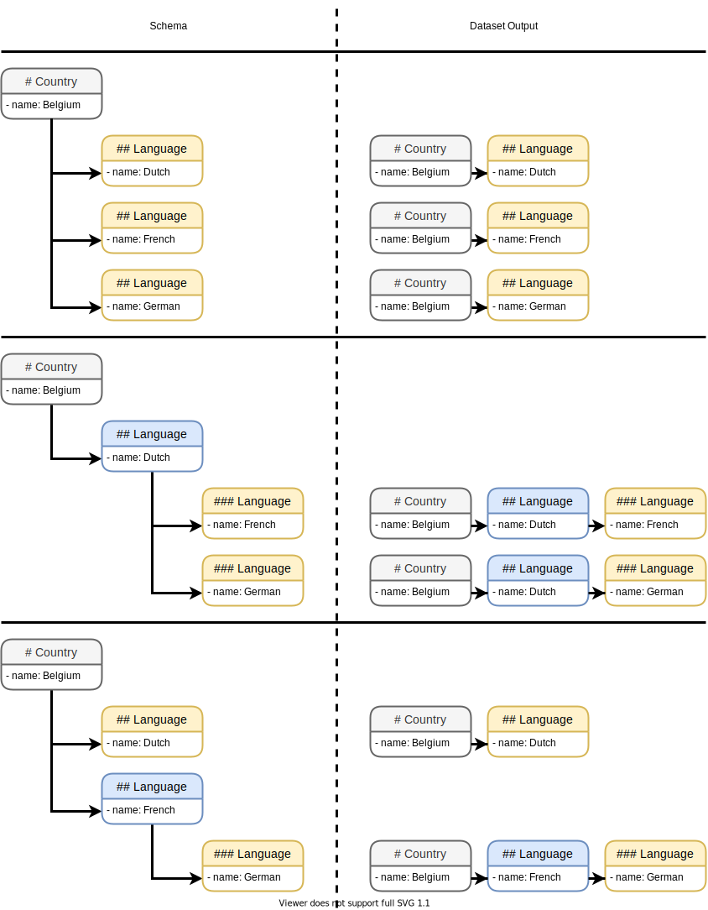

# Entry

Entry is a collection of variables.
An entry name is proceeded by one or multiple pound signs `#`, in the form of:

```markdown
# <entry name>
- <key 1>: <value 1>
- <key 2>: <value 2>
...
- <key n>: <value n>
```
`# Example` in previous examples are Level-1 Entries, as denoted by the single leading pound sign.
All REAM files start with a Level-1 Entry, and contain exactly one Level-1 Entry.

Entries are useful when describing an object with multiple attributes:

```markdown
# Country
- name: Belgium
- capital: Brussels
- population: $11433256$
- euro zone: `TRUE`
```

<EditorLite-EditorLite item="entry1" />

Let's add some annotations.
```markdown
# Country
- name: Belgium
  > short for the Kingdom of Belgium
- capital: Brussels
- population: $11433256$
  > data from 2019; retrieved from World Bank
- euro zone: `TRUE`
  > joined in 1999
```

<EditorLite-EditorLite item="entry2" />

Entries should have local unique keys.
The following code will raise error:
```markdown
# Country
- name: Belgium
- language: Dutch
- language: French
- language: German
```
::: details Known Issue
The current parser don't check for duplicate keys, so technically this is still valid.
This rule will be enforced in future versions.
:::

## Subentry

Entries can be nested, and the level of the entry is denoted by the number of leading pound signs.
So a Level-1 Entry takes the form of `# <Level 1 Entry Name>`, and a Level-2 Entry takes the form of `## <Level 2 Entry Name>`, and so forth.

Examples:
```markdown
# Country
- name: Belgium

## Language
- name: Dutch

## Language
- name: French

## Language
- name: German
```
<EditorLite-EditorLite item="entry3" />

The `# Country` entry has one variable `name` and three Level-2 child entries `## Language`.
The three `## Language`  subentries are also known as the *terminal nodes* as they do not contain any subentry.
When compiling the dataset, the parser look for all terminal nodes in the REAM file and flatten the data structure.
Thus the previous example produces a dataset with three rows (one for each terminal node) and two columns (one of each variable).

Note that the variable keys are scoped, so `## Language` is allowed to have a variable with the key `name` despite its parent entry `# Country` also contain a variable with the same key.

Entry must be nested in order.
Level-2 Entries can only be nested in a Level-1 Entry, and Level-3 Entries can only be nested in a Level-2 Entry, and so forth.
Compare the datasets compiled from the following two examples with the previous one:
```markdown
# Country
- name: Belgium

## Language
- name: Dutch
  > This is in a Level 2 Entry

### Language
- name: French
  > This is in a Level 3 Entry

### Language
- name: German
  > This is in a Level 3 Entry
```
<EditorLite-EditorLite item="entry4" />

```markdown
# Country
- name: Belgium

## Language
- name: Dutch
  > This is in a Level 2 Entry

## Language
- name: French
  > This is in a Level 2 Entry

### Language
  > This is in a Level 3 Entry
- name: German
```

<EditorLite-EditorLite item="entry5" />

A visualization of the differences between the three schemas are as follows.
The terminal nodes are colored yellow.




A level can contain subentires of differenct classes:

```markdown
# Country
- name: Belgium

## City
- name: Brussels

## Language
- name: Dutch
```

<EditorLite-EditorLite item="entry6" />

Also, entries of the same class need not have identical variables, nor the same variable order.
```markdown
# Country
- name: Belgium

## Language
- name: Dutch
- size: $0.59$

## Language
- size: $0.4$
- name: French

## Language
- name: German
```


<EditorLite-EditorLite item="entry7" />

Observe that the order of the variables are preserved by default.

The datasets compiled by the last two examples are not too useful for analysis.
To compile quality analysis-ready datasets, we should specify the schema of the datasets in the codebook.
