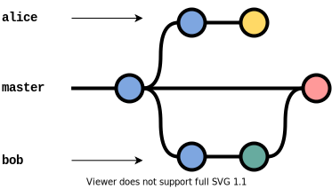
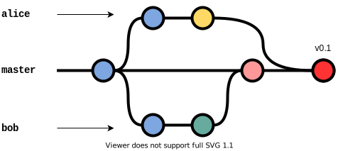
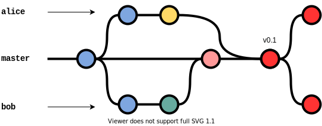

# Git Integration

[Git](https://git-scm.com/) is a distributed version control system for personal and collaborative projects.
It is widely used in programming but can also be applied to other non-tech files, including REAM files.

This section is not a tutorial on Git, but to showcase what a workflow is like when using REAM and Git without (too many) technical terminologies.

## Example

For this example, we want to collect every country's population and GDP for the year 2019.
At the first phase of the data collection process, we focus on two countries: Afghanistan and Albania.

We start by creating a template for `data.md`:

```markdown
# Dataset

## Country
- name: Afghanistan
- pop: %
- GDP: %

## Country
- name: Albania
- pop: %
- GDP: %

## Country
- name: Algeria
- pop: %
- GDP: %
```
and save a snapshot of it.
This snapshot is known as a *commit*.

Your two collaborators, Alice and Bob, specializes in Asia and Europe respectively and are tasked to collect data for corresponding region.
Each of them download a copy of the `data.md` file, to their own *branches*, and work on the files separately.

Now there are three versions of the same file in three branches: `master`, `alice` and `bob`.


Alice adds the relevant information into `data.md` in the `alice` branch, and commit the changes:
```markdown
# Dataset

## Country
- name: Afghanistan
- pop: $38041754$
- GDP: $1901353830$

## Country
- name: Albania
- pop: %
- GDP: %

## Country
- name: Algeria
- pop: %
- GDP: %
```


Similarly, Bob adds the relevant information and commit the changes:
```markdown
# Dataset

## Country
- name: Afghanistan
- pop: %
- GDP: %

## Country
- name: Albania
- pop: $2854191$
- GDP: $15278077450$

## Country
- name: Algeria
- pop: %
- GDP: %
```


Note that neither Alice nor Bob is able to see the changes committed in the other branch.

To update the `master` branch, Alice and Bob have to request the changes to be pulled to the `master` branch.
Such requests are called *pull requests*.

The `master` branch first merges the changes committed in `bob`.

```markdown
# Dataset

## Country
- name: Afghanistan
- pop: %
- GDP: %

## Country
- name: Albania
- pop: $2854191$
- GDP: $15278077450$

## Country
- name: Algeria
- pop: %
- GDP: %
```



Then merges the changes committed in `alice`.
The first phase is now completed, and is *tagged* as version `v0.1`.

```markdown
# Dataset

## Country
- name: Afghanistan
- pop: $38041754$
- GDP: $1901353830$

## Country
- name: Albania
- pop: $2854191$
- GDP: $15278077450$

## Country
- name: Algeria
- pop: %
- GDP: %
```


To keep their branches updated with `master`, Alice and Bob need to *rebase* their branches to `master`.



And the cycle goes on.
