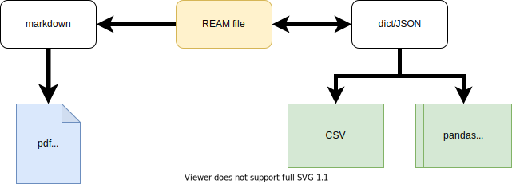
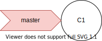
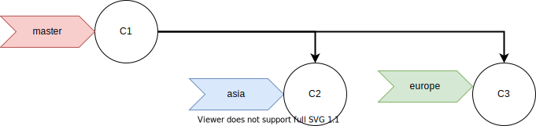
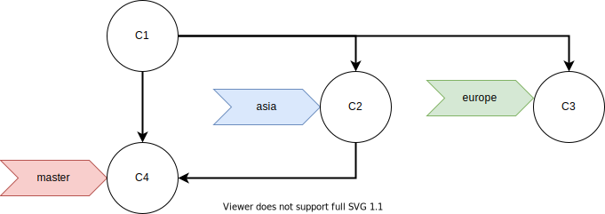
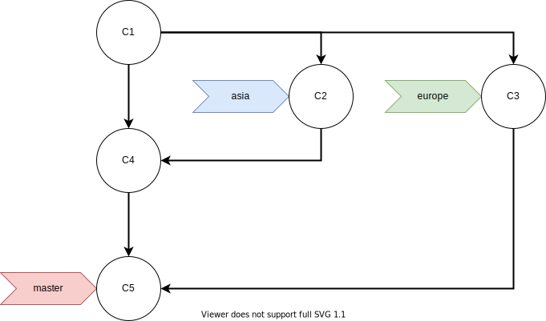
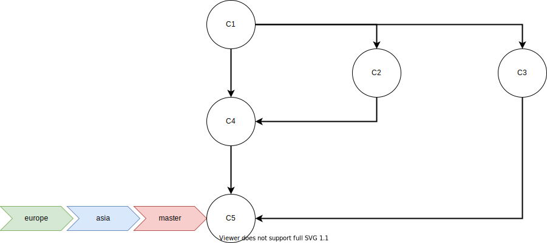

# REAM

> It reads like Markdown, writes like Markdown, converts like Markdown. Is it Markdown?

> **RE**AM **a**in't **M**arkdown


## Introduction

REAM is a collection of tools to create, update, distribute* and reuse* social science datasets in a saner way, for both personal and collaborative project.
It includes three components:

1. [ream-lang](https://www.github.com/chmlee/ream-lang):
a data serialization standard with Markdown-like syntax

2. [ream-python](https://www.github.com/chmlee/ream-python):
an encoder/decoder for REAM files written in Python

3. ream-studio:
a graphical application to edit REAM files and asynchronous syntax checking (in production)

4. [ream-script*](#):
a [Jinja](https://jinja.palletsprojects.com/en/2.11.x/)-inspired templating language to make modularizing REAM datasets possible (planned)

5. [rdm*](#):
a data managing utility to build your own database of REAM datasets (planned)

The remaining of this documentation focuses on the serialization standard, with occasional reference to the encoder/decoder.
See [ream-python](https://www.github.com/chmlee/ream-python) for the documentation of the encoder/decoder.

## Table of Contents

- [Introduction](#introduction)
- [Design Principles](#design-principles)
- [Specifications](#specifications)
- [Basic Structures](#basic-structures)
  * [Variable](#variable)
    - [String](#string)
    - [Number](#number)
    - [Boolean](#boolean)
    - [NA](#NA)
  * [Comment](#comment)
  * [Entry](#entry)
    - [Nested Entry](#nested-entry)
- [The structure of a REAM file](#)
- [Using REAM with Git](#using-ream-with-git)

## Design Principles

  

- **Two-in-one**

    Write once, and let the computer generate the documentation and dataset.
    No more separate applications for different files.

- **Human Readable**

    Read and write datasets like you normally do on a text document.
    No more scrolling horizontally through multiple columns to locate the relevant cells.

- **Plain Text**

    Edit your datasets with your favourite editor in any operation systems.
    No more proprietary softwares and formats.

    Also, use [git](https://en.wikipedia.org/wiki/Git) to perform version control and manage project collaboration.
    [What is git and why you should use it with REAM.](#using-ream-with-git)

- **One-to-one correspondence to JSON**

    Integrate REAM into your application easily with the existing parser.
    No need to write a parser from the ground-up.

## Specifications
- Case sensitive.
- Indentation insensitive: leading and trailing whitespaces, that is, tabs (`0x09`) and spaces (`0x20`), are ignored. The use of tabs is discouraged.
- Empty lines (lines consist of only `/n` or `/r/n`) are ignored.

## Basic Structures

REAM has two basic structures:

- `<variable>`: `<key>` - `<value>` pair
- `<entry>`: a collection of `<variable>`

### Variable

`<variable>` assigns a `<value>` to a `<key>`, in the form of

```markdown
- <key>: <value>
```

`<variable>` starts with a dash `-`.
`<value>` and `<key>` are separated by a colon `:`.

`<key>` can't be empty.
It may contain upper and lowercase letters (A-Z, a-z), digits (0-9) and spaces (`0x20`), and must starts with an upper or lowercase letter.
There is no need to quote keys.

> NOTE: in theory all non-numeric UTF-8 characters except colons should work, but this remains to be tested.

`<value>` can be any of the following types:

- [String](#string)
- [Number](#number)
- [Boolean](#boolean)
- [NA](#na)
- [Star List](#star-list)

#### String

Example:
```markdown
- string 1: value 1
- string 2: value 2
- string 3: value 3
```

There is no need quote strings; quotation marks will be stored as it is.

```markdown
- string 1: value 1
- string 2: 'value 2'
- string 3: "value 3"
```
is mapped the following JSON:
```json
{
  "string 1": "value 1",
  "string 2": "'value 2'",
  "string 3": "\"value 3\""
}
```

Recall that REAM ignores all leading and trailing spaces.
So

```markdown
- string 1:value 1
 - string 2: value 2
     -       string 3   :   value 3
-string 4:value 4
```
is equivalent to
```markdown
- string 1: value 1
- string 2: value 2
- string 3: value 3
- string 4: value 4
```

Nevertheless, it is recommended to stick to one Markdown flavor regarding indentations so as to be markdown-compatible.

#### Number

Numbers are surrounded by dollar signs `$`

##### Number Literals

```markdown
- number 1: $1$
- number 2: $-2$
- number 3: $3.1415926$
```

Underscores can be used as separators to improve readability, and can be placed at anywhere within the dollar signs.

> NOTE: stricter rules might be implemented regarding where underscores can be places, like [TOML](https://github.com/toml-lang/toml#float).

```markdown
- number 4: $123_456_789$
- number 5: $1_2345_6789$
```

##### Scientific Notation

```markdown
- scientific notation 1: $3e8$
- scientific notation 2: $6.02E23$
```

##### Fraction

> NOTE: experimental

```markdown
- fraction 1: $\frac{1}{3}$
- fraction 2: $1/3$
- fraction 3: $2 1/4$
```

##### Important Note

**By default**, all numbers are stored as **strings** when converting to JSON, preserving the surrounding dollar signs.
So the variables above would generate the following JSON:

```json
{
  "number 1": "$1$",
  "number 2": "$-2$",
  "number 3": "$3.1415926$",
  "number 4": "$123456789$",
  "number 5": "$123456789$",
  "scientific notation 1": "$3e8$",
  "scientific notation 2": "$6.02E23$",
  "fraction 1": "$\\frac{1}{3}$",
  "fraction 2": "$1/3$",
  "fraction 3": "$2 1/4$"
}
```

Readers familiar with programming may notice no number representation is specified.
There is no integers or floats, and every "number" is stored as a string by default.
The absence of clear specification is a feature, not a bug.

Not all real numbers can be correctly interpreted by modern computers, and will be rounded somewhere during the computation.
Those that can be correctly interpreting might also be rounded to speed up the computation or save storage space.

If rounding errors are almost inevitable in computations, at the very least we should control when roundings can and can't occur.
**You should avoid roundings when storing numeric data in REAM files.**
When we store the fraction $1/3$ in our datasets, we should store the fraction `1/3`, not `0.3`, or `0.33`, or any of its approximations.
As a result, when we see the number `0.33`, we know for certain that it represents the real number $0.33$, and not an approximation of $0.32999$, $0.33001$, or $1/3$.

The trade-off made here is obvious: sacrificing compiling time to human readability.
When compiling REAM files to analysis-ready datasets, the strings representing numbers would need be evaluated, slowing down the process.
But remember, REAM files are more often read and edited than compiled.

That being said, REAM parsers should be clear what library and/or method are implemented when evaluating , and provide the users with the choice to specify their own.

> NOTE: Not sure if this is a prevailing problem in social science.

#### Boolean

Boolean values are `_TRUE_` and `_FALSE_`, both uppercase and surrounded by one underscore `_`.

```markdown
- bool 1: _TRUE_
- bool 2: _FALSE_
- not bool 1: TRUE
- not bool 2: _True_
```
maps to the following JSON:

```json
{
    "bool 1": "_TRUE_",
    "bool 2": "_FALSE_",
    "not bool 1": "TRUE",
    "not bool 2": "_True_"
}
```
<!-- Note that the boolean values must be exact matches, or else they are treated as strings. -->

#### NA

Assign `_NA_` to store "no response"

```markdown
- valid na: _NA_
- invalid na 1: NA
- invalid na 2: _Na_
```
maps to the following JSON:
```josn
{
    "valid na": "_NA_",
    "invalid na 1": "NA",
    "invalid na 2": "_Na_"
}
```

<!-- Again, if the value is not an exact match to `_NA_`, it is stored as a string. -->

> NOTE: I am considering mapping all controlled values (`_TRUE_`, `_FALSE_` and `_NA_`) to their equivalences in JSON (`true`, `false`, `none`)

#### Star List

A Star lists is a sequence of strings, numbers, boolean and/or NA, in the form of:

```
- <key>:
  * <item>
  * <item>
  ...
  * <item>
```

Example:
```markdown
- list of string:
  * text 1
  * text 2
  * text 3
- list of numbers:
  * $1$
  * $2$
  * $3.14159$
- list of mixed types:
  * text
  * $2$
  * _TRUE_
- still a list:
* item 1
* item 2
* item 3
- still a list but not recommended:
* item 1
  * item 2
 * item 3
- also not recommended:
  * item 1

  * item 2
  * item 3
```
translates to:
```json
{
    "list of string": [
        "text 1",
        "text 2",
        "text 3"
    ],
    "list of numbers": [
        "$1$",
        "$2$",
        "$3.14159$"
    ],
    "list of mixed types": [
        "text",
        "$2$",
        "_TRUE_"
    ],
    "still a list": [
        "item 1",
        "item 2",
        "item 3"
    ],
    "still a list but not recommended": [
        "item 1",
        "item 2",
        "item 3"
    ],
    "also not recommended": [
        "item 1",
        "item 2",
        "item 3"
    ]
}
```

Indentations are optional, so choose the scheme required by the file converter of your choice.

### Comment

Comments follow strings, numbers, booleans and NA, in the form of

```markdown
- <key>: <value>
  > <comment>
```
for variables, and

```markdown
- <key>: <value>
  * <item>
    > <comment>
```
for elements in star lists.

Example:
```markdown
- key 1: value 1
  > comment for value 1
- key 2: value 2
- key 3: value 3

  > valid comment for value 3

- key 4: $1$
  > comment for numbers
- key 5: _TRUE_
  > comment for boolean
- key 6: _NA_
  > comment for NA
- list:
  * item 1
    > comment for item 1
  * item 2

    > valid comment for item 2

  * item 3
```
translates to:
```json
{
    "key 1": "value 1__COM__comment for value 1",
    "key 2": "value 2",
    "key 3": "value 3__COM__valid comment for value 3",
    "key 4": "$1$__COM__comment for numbers",
    "key 5": "_TRUE___COM__comment for boolean",
    "key 6": "_NA___COM__comment for NA",
    "list": [
        "item 1__COM__comment for item 1",
        "item 2__COM__valid comment for item 2",
        "item 3"
    ]
}
```

Again, chose your indentation scheme accordingly.


### Entry

Entry is a collection of variables.
An entry name is proceeded by one or multiple pound signs `#`

```markdown
# <entry name>
- <key 1>: <value 1>
- <key 2>: <value 2>
...
- <key n>: <value n>
```

For example:
```markdown
# Country
- name: The Kingdom of Belgium
- capital: Brussels
- population: $11_433_256$
- permanent member of UNSC: `FALSE`
- languages:
  * Dutch
    > Official language
  * French
    > Official language
  * German
    > Official language
```

This corresponds to the following JSON:

```json
{
    "Country": [
        {
            "name": "The Kingdom of Belgium",
            "capital": "Brussels",
            "population": "$11_433_652$",
            "permanent member of UNSC": "_FALSE_",
            "languages": [
                "Dutch__COM__Official language",
                "French__COM__Official language",
                "German__COM__Official language"
            ]
        }
    ]
}
```

Entries should have unique keys.
The following code will raise error:
```markdown
# Country
- name: The Kingdom of Belgium
- name: Belgium
- capital: Brussels
```

#### Nested Entry

Entries can be nested, and the nest level is indicated by the number of leading pound signs.
A Level-1 entry (the top level entry) would have the form `# <Level-1 entry name>`, and Level-2 entry the form `## <Level-2 entry name>`, and so on.
Only Level-n entry can be nested to Level-(n+1) entry.


So
```markdown
# Country
- name: The Kingdom of
## language
- name: Dutch
## language
- name: French
## language
- name: German
```
is valid, but not
```markdown
# Country
- name: The Kingdom of
### language
- name: Dutch
### language
- name: French
### language
- name: German
```
since Level-3 entries are nested in a Level-1 entry.

Example:
```markdown
# Country
- name: The Kingdom of Belgium
- capital: Brussels
- population: $11_433_256$
- permanent member of UNSC: `FALSE`

## language
- name: Dutch
- official language: `TRUE`
- size: $0.6$
  > source: CIA World Factbook

## language
- name: French
- official language: `TRUE`
- size: $0.4$
  > source: CIA World Factbook

## language
- name: German
- official language: `TRUE`
- size: less than 0.01
  > source: CIA World Factbook
```
is equivalent to the following JSON:

```json
{
    "Country": [
        {
            "name": "The Kingdom of Belgium",
            "capital": "Brussels",
            "population": "$11_433_256$",
            "permanent member of UNSC": "FALSE",
            "language": [
                {
                    "name": "Dutch",
                    "official language": "TRUE",
                    "size": "$0.6$__COM__source: CIA World Factbook"
                },
                {
                    "name": "French",
                    "official language": "TRUE",
                    "size": "$0.4$__COM__source: CIA World Factbook"
                },
                {
                    "name": "German",
                    "official language": "TRUE",
                    "size": "less than 0.01__COM__source: CIA World Factbook"
                }
            ]
        }
    ]
}
```

Even more level can be nested:
```markdown
# Country
- name: The Kingdom of Belgium
- code: BE

## Region
- name: Brussels-Capital Region
- code: BRU

## Region
- name: Flemish Region
- code: VLG

### Province
- name: Antwerpen
- code: VAN

### Province
- name: Limburg
- code: VLI

### Province
- name: Oost-Vlaanderen
- code: VOV

### Province
- name: Vlaams-Brabant
- code: VBR

### Province
- name: West-Vlaanderen
- code: VWV

## Region
- name: Walloon Region
- code: WAL

### Province
- name: Brabant wallon
- code: WBR

### Province
- name: Hainaut
- code: WHT

### Province
- name: Liège
- code: WLG

### Province
- name: Luxembourg
- code: WLX

### Province
- name: Namur
- code: WNA
```
maps to the following JSON:

```json
{
    "Country": [
        {
            "name": "The Kingdom of Belgium",
            "code": "BE",
            "Region": [
                {
                    "name": "Brussels-Capital Region",
                    "code": "BRU"
                },
                {
                    "name": "Flemish Region",
                    "code": "VLG",
                    "Province": [
                        {
                            "name": "Antwerpen",
                            "code": "VAN"
                        },
                        {
                            "name": "Limburg",
                            "code": "VLI"
                        },
                        {
                            "name": "Oost-Vlaanderen",
                            "code": "VOV"
                        },
                        {
                            "name": "Vlaams-Brabant",
                            "code": "VBR"
                        },
                        {
                            "name": "West-Vlaanderen",
                            "code": "VWV"
                        }
                    ]
                },
                {
                    "name": "Walloon Region",
                    "code": "WAL",
                    "Province": [
                        {
                            "name": "Brabant wallon ",
                            "code": "WBR"
                        },
                        {
                            "name": "Hainaut ",
                            "code": "WHT"
                        },
                        {
                            "name": "Li\u00e8ge",
                            "code": "WLG"
                        },
                        {
                            "name": "Luxembourg",
                            "code": "WLX"
                        },
                        {
                            "name": "Namur ",
                            "code": "WNA"
                        }
                    ]
                }
            ]
        }
    ]
}
```

REAM supports up to 6 nest levels.

> NOTE: Level restriction may be lifted when the parser is updated.

Different types of entries can exists in the same level.
For example:
```markdown
# Country
- name: The Kingdom of Belgium

## language
- name: Dutch

## language
- name: French

## language
- name: German

## Region
- name: Brussels-Capital Region

## Region
- name: Flemish Region

## Region
- name: Walloon Region
```
translates to
```JSON
{
    "Country": [
        {
            "name": "The Kingdom of Belgium",
            "language": [
                {
                    "name": "Dutch"
                },
                {
                    "name": "French"
                },
                {
                    "name": "German"
                }
            ],
            "Region": [
                {
                    "name": "Brussels-Capital Region"
                },
                {
                    "name": "Flemish Region"
                },
                {
                    "name": "Walloon Region"
                }
            ]
        }
    ]
}
```

Entries in the same level should be ordered by their types.
Mixing entry types is highly discouraged, as it is almost certain that the order would not be preserved.

The following is highly discouraged, though the content is more or less the same as the previous example:
```markdown
# Country
- name: The Kingdom of Belgium

## Region
- name: Brussels-Capital Region

## Region
- name: Flemish Region

## language
- name: Dutch

## Region
- name: Walloon Region

## language
- name: French

## language
- name: German
```


> NOTE: Dictionary order in Python 3.7+ is considered to be reliable, so as long as entries are ordered by types, the entry order *should* be preserved.
> This remains to be tested.

All REAM file should either start with a Level-1 entry, or no entry at all.

## Using REAM with Git

[Git](https://git-scm.com/) is a piece of free software that perform version control and manage collaboration.
It is widely used in programming but can also be applied to other non-tech files, such as REAM files.

This section is not a tutorial of git, but to showcase what a potential workflow is like when using REAM and git.
Hopefully this will convince readers that REAM + git are the right tools to create and manage your next datasets.

Say I want to find whether the country's population explains its GDP.
To create a dataset to perform the statistical analysis, I decide on an entry structure as follows:
```markdown
# Country
- name: <country name>
- pop: <country population>
- GDP: <country GDP in USD>
```

For the first phase of the project, I plan to collect data on Afghanistan and Albania.
So I create the REAM file `data.md` with the following content:
```markdown
# Country
- name: Afghanistan
- pop: _
- GDP: _

# Country
- name: Albania
- pop: _
- GDP: _
```
and save a snapshot (commit) of it, named `C1`.
By default, this initial snapshot would be known as the `master` version (branch)



The `C1` in the diagram is the commit previous made. The `master` ribbon indicates the latest changes of the `master` branch.

My two associates, Alice from the Asia team and Bob from the Europe team, are tasked to fill in the information for Afghanistan and Albania respectively.
I create two additional branches, named `asia` and `europe`, for them to work on without changin `master`.


Note than all three branches are pointing at the same commit `C1`; Alice and Bob hasn't changed anything in their `data.md` yet, hence the latest changes on their branches are identical to that on `master`.

<div class="row">
  <div class="column">
    <div class="branch">
      master (C1)
    </div>

<pre>
# Country
- name: Afghanistan
- pop: _
- GDP: _

# Country
- name: Albania
- pop: _
- GDP: _
</pre>
  </div>
  <div class="column">
    <div class="branch">
      asia (C1)
    </div>

<pre>
# Country
- name: Afghanistan
- pop: _
- GDP: _

# Country
- name: Albania
- pop: _
- GDP: _
</pre>
  </div>
  <div class="column">
    <div class="branch">
      europe (C1)
    </div>

<pre>
# Country
- name: Afghanistan
- pop: _
- GDP: _

# Country
- name: Albania
- pop: _
- GDP: _
</pre>
  </div>

</div>

Now Alice and Bob start working on their designated parts.
After relevant information is added, they commit in their own branches, creating commit `C2` and `C3`.



<div class="row">
  <div class="column">
    <div class="branch">
      master (C1)
    </div>

<pre>
# Country
- name: Afghanistan
- pop: _
- GDP: _

# Country
- name: Albania
- pop: _
- GDP: _
</pre>
  </div>
  <div class="column">
    <div class="branch">
      asia (C2)
    </div>

<pre>
# Country
- name: Afghanistan
- pop: $37_172_386$
- GDP: $19_362_969_580$

# Country
- name: Albania
- pop: _
- GDP: _
</pre>
  </div>
  <div class="column">
    <div class="branch">
      europe (C3)
    </div>

<pre>
# Country
- name: Afghanistan
- pop: _
- GDP: _

# Country
- name: Albania
- pop: $2_866_376$
- GDP: $15_102_500_900$
</pre>
  </div>
</div>

To see the updates made by my two associates, I first merge `asia` to `master`, creating a new commit `C4`.



Note the despite having identical `data.md`, `master` points to the newly created `C4` while `asia` points to `C2`.

<div class="row">
  <div class="column">
    <div class="branch">
      master (C4)
    </div>

<pre>
# Country
- name: Afghanistan
- pop: $37_172_386$
- GDP: $19_362_969_580$

# Country
- name: Albania
- pop: _
- GDP: _
</pre>
  </div>
  <div class="column">
    <div class="branch">
      asia (C2)
    </div>

<pre>
# Country
- name: Afghanistan
- pop: $37_172_386$
- GDP: $19_362_969_580$

# Country
- name: Albania
- pop: _
- GDP: _
</pre>
  </div>
  <div class="column">
    <div class="branch">
      europe (C3)
    </div>

<pre>
# Country
- name: Afghanistan
- pop: _
- GDP: _

# Country
- name: Albania
- pop: $2_866_376$
- GDP: $15_102_500_900$
</pre>
  </div>
</div>

I then merge `europe` to `master`, creating `C5`



<div class="row">
  <div class="column">
    <div class="branch">
      master (C5)
    </div>

<pre>
# Country
- name: Afghanistan
- pop: $37_172_386$
- GDP: $19_362_969_580$

# Country
- name: Albania
- pop: $2_866_376$
- GDP: $15_102_500_900$
</pre>
  </div>
  <div class="column">
    <div class="branch">
      asia (C2)
    </div>

<pre>
# Country
- name: Afghanistan
- pop: $37_172_386$
- GDP: $19_362_969_580$

# Country
- name: Albania
- pop: _
- GDP: _
</pre>
  </div>
  <div class="column">
    <div class="branch">
      europe (C3)
    </div>

<pre>
# Country
- name: Afghanistan
- pop: _
- GDP: _

# Country
- name: Albania
- pop: $2_866_376$
- GDP: $15_102_500_900$
</pre>
  </div>
</div>

To receive the latest updates, Alice and Bob sync their branches with `master` (rebase).



<div class="row">
  <div class="column">
    <div class="branch">
      master (C5)
    </div>

<pre>
# Country
- name: Afghanistan
- pop: $37_172_386$
- GDP: $19_362_969_580$

# Country
- name: Albania
- pop: $2_866_376$
- GDP: $15_102_500_900$
</pre>
  </div>
  <div class="column">
    <div class="branch">
      asia (C5)
    </div>

<pre>
# Country
- name: Afghanistan
- pop: $37_172_386$
- GDP: $19_362_969_580$

# Country
- name: Albania
- pop: $2_866_376$
- GDP: $15_102_500_900$
</pre>
  </div>
  <div class="column">
    <div class="branch">
      Europe (C5)
    </div>

<pre>
# Country
- name: Afghanistan
- pop: $37_172_386$
- GDP: $19_362_969_580$

# Country
- name: Albania
- pop: $2_866_376$
- GDP: $15_102_500_900$
</pre>
  </div>
</div>

Now all three branches are up to dates, and are ready for the next assignments.

With git, [more than 15,600](https://www.linuxfoundation.org/blog/2017/10/2017-linux-kernel-report-highlights-developers-roles-accelerating-pace-change/) developers contributed


<style>
.column {
  float: left;
  width: 33.33%;
}

/* Clear floats after the columns */
.row:after {
  content: "";
  display: table;
  clear: both;
}
</style>
