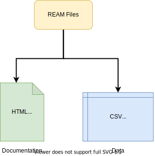

> It reads like Markdown, writes like Markdonw, converts like Markdown.
> Is it Markdown?

> **RE**am **A**int **M**arkdown!

```ream
# Country
- name: Belgium
- capital: Brussels
- population: $11433256$
  > data from 2019; retrieved from World Bank
- euro zone: `TRUE`
  > joined in 1999

## Language
- name: Dutch

## Language
- name: French

## Language
- name: German
```


<EditorLite-EditorLite item="entry8" showDefault="True"/>


REAM is a data serialization standard with Markdown-like syntax.
The language encourages inline documentation for individual data points, and aims to be the human-readable, modular, interoperable and reusable "source code" of social science datasets.

Multiple tools build around the language are under active development to provide a user-friendly workflow to create, edit and distribute REAM datasets, including a [parser](https://github.com/chmlee/reamparser.js) that compiles REAM file into analysis-ready format and an [online editor](https://chmlee.github.io/ream-editor).
See [Toolchain](/ream-doc/Toolchain) for more information.

Though not required, the language and the toolchain are designed to work with [Git](https://git-scm.com/), a distributed version control system for personal and collaborative projects.
[See how REAM works with Git](/ream-doc/Language/Git-Integration.html#example).



::: warning NOTE
The project is still at its alpha stage:
features are added and removed constantly, and backward compatibility is not guaranteed.
You are free to play around with the tools, but it's not recommended that you use them for anything serious before it enters beta stage (probably not until summer 2021).

See [Roadmap](#) for more information.
:::
